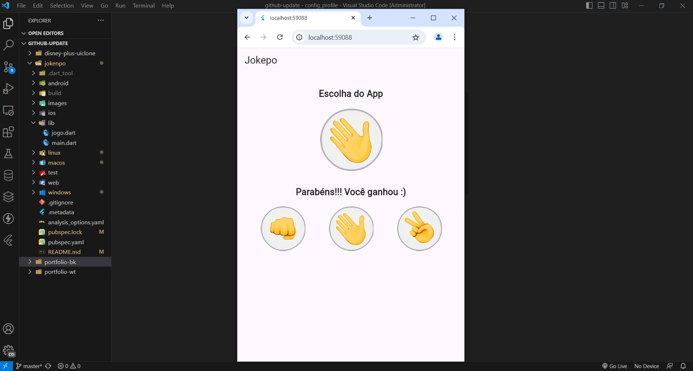

<h1 align="center"> Flutter App Jokenpo </h1>

Projeto desenvolvido no curso de flutter da udemy 

  <a href="#memo-tecnologias">Tecnologias</a>&nbsp;&nbsp;&nbsp;|&nbsp;&nbsp;&nbsp;
  <a href="#memo-projeto">Projeto</a>&nbsp;&nbsp;&nbsp;|&nbsp;&nbsp;&nbsp;
  <a href="#memo-layout">Layout</a>&nbsp;&nbsp;&nbsp;|&nbsp;&nbsp;&nbsp;
  <a href="#memo-licença">Licença</a>

  

 

  

 

## 🚀 Tecnologias

Esse projeto foi desenvolvido com as seguintes tecnologias:

- Flutter Framework
- Dart Lang
- Git e Github
- Figma

## 💻 Projeto

Jogo criado em flutter com dart lang do tradicional jokenpo

<!-- - [Acesse o projeto finalizado, online](https://maykbrito.github.io/devlinks) -->

<!-- - [Assistir aulas](https://lp.rocketseat.com.br/devlinks/inscricao?utm_source=github&utm_medium=descricao&utm_campaign=capture-devlinks&utm_term=organic&utm_content=descricao-github-mayk-brito) -->

## 🔖 Layout

Você pode visualizar o layout do projeto através [DESSE LINK](https://www.figma.com). É necessário ter conta no [Figma](https://figma.com) para acessá-lo.

## Licença

Esse projeto está sob a licença MIT.

---

Feito por Jhonatan Pacheco com ♥ by JPDEV [Acesse meu portfolio de projetos!](https://www.jpdev.com.br)
